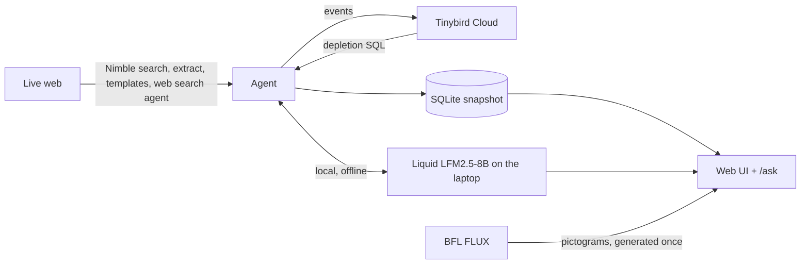

# Shelfwatch

**An autonomous agent that tracks Hurricane Nolo and live stock of emergency supplies for Hawaii's Big Island and Maui — and keeps helping offline when the internet goes down.**

## Why it matters

Hurricane Nolo is approaching Hawaii with a Hurricane Watch and a Tropical Storm Warning for Hawaii County, and power and communications outages are possible. On the last preparation day, people drive from store to store looking for batteries, tarps and gas cans, and supplies disappear one shelf at a time. When the storm arrives, the right answer changes from "where to buy" to "stay put, here are the shelters", and the internet may be gone exactly when people need that answer.

## What each search run does

For the demo, the operator presses **Run search** on `/agent`. Each press runs one complete cycle:

1. **Tracks the storm.** Searches live news and official advisories (NWS / Central Pacific Hurricane Center), reads the top sources, and notices warning changes and track shifts.
2. **Ranks the areas.** Scores each ZIP (Hilo 96720, Kailua-Kona 96740) by phase, windward exposure, warnings and recent shortages, and re-ranks when the forecast moves.
3. **Finds stores.** Google Maps search per ZIP for Walmart, Home Depot, Target and hardware stores; de-duplicates by normalized address; re-scans every 2 hours.
4. **Checks stock.** Ten essentials (D and AA batteries, flashlights, water, tarps, sandbags, first aid kits, power banks, gas cans, generators) against Walmart's pickup availability for each ZIP, repeatedly, recording every check.
5. **Forecasts what runs out next** from the history of its own checks (share of stores low/out, plus stores that flipped from in stock to low/out in the last 3 hours).
6. **Publishes a live "where to get it" view** where every entry shows when it was checked, a confidence and the data level.
7. **Switches phases per area:** BEFORE (where to get supplies) → DURING (no store trips; shelters and official instructions) → AFTER (recovery).
8. **Keeps working offline.** The brain is a local Liquid model on the laptop; with the wifi off, `/ask` answers from the last synced snapshot and says how old it is.

## Architecture



- `agent/agent.py` — one cycle: storm → phases + ranking → store scans → collect finished checks → start new checks → forecast → journal entry → checkpoint.
- `agent/storm.py`, `stores.py`, `stock.py`, `forecast.py`, `state.py` — one job each.
- `app/` — FastAPI server, SQLite, service clients (each with a mock mode), the safety gate, `/ask`.
- `web/` — plain HTML + JS, Leaflet served from the repo (no CDN, so the map loads offline).
- `tinybird/resources.py` — datasources and endpoints, deployed with the Tinybird Python SDK.

Nimble template runs take 5–11 minutes, so the agent **starts** checks on one cycle and **collects** them on a later one. Nothing ever blocks the loop, and task ids are checkpointed so a restart never pays twice.

## Sponsor tools and exactly what each does

| Tool | What it does here |
|---|---|
| **Nimble** | All live web data. **Search** (`focus="news"`, `time_range="day"`) for storm news and advisories. **Extract** to read the top advisory pages. **Extract Templates**: `walmart_serp` with the ZIP for pickup availability and price, `google_maps_search` for store discovery. **Web Search Agent** (in the background, every 3 hours) for currently open shelters with sources. |
| **Liquid AI** | The agent's brain, running locally (`LiquidAI/LFM2.5-8B-A1B-MLX-4bit` via `mlx_lm.server`). Reads the advisories and proposes a phase and storm onset per area; writes the answers on `/ask`. Works with the internet off. No OpenAI anywhere. |
| **Tinybird** | Time-series memory. Every stock check and storm update is queued locally and sent to Tinybird Cloud. Published SQL endpoints `depletion_by_item_zip` (stockout risk) and `stock_timeline` (15-minute buckets for the chart) drive the forecast. If Tinybird is unreachable, the same math runs in SQLite. |
| **BFL FLUX** | All images are language-free, with no text or facts inside them, so they work for Hawaii's many languages. **Item pictograms** for the 10 essentials. **Safety pictograms** for 7 standard guidance points (stay indoors, turn around don't drown, go to a shelter if told to evacuate, generators outside only, and more), each shown next to its fixed English sentence. **Shareable status cards:** FLUX makes one calm background per area, and Pillow writes the verified facts on top at request time (`/api/cards/{zip}`, ~90 KB JPEG, small enough to text over a weak connection). Everything is generated once, cached and served locally, so it all works offline. 20 image calls in total. |

## Numbers from today's run

From `scripts/demo_stats.py` at 13:52 PT (10:52 HST), about an hour after the agent started. Re-run it for current numbers: `.venv/bin/python -m scripts.demo_stats`.

| | |
|---|---|
| Agent running since | 12:46 PT, 14 steps |
| Stock checks recorded | 40 (26 in stock, 3 low, 11 unknown) |
| Stores found | 26 in 2 ZIPs (2 Walmart, 2 Home Depot, 2 Target, 20 other) |
| Storm updates read | 9 |
| Phase changes | 1, a false alarm the agent's new rule now prevents (see below) |
| Forecasts | 13; at risk now: gas cans (0.6) and power banks (0.3) in Hilo |
| Official and shelter links | 17 |
| Nimble calls used | 288 of 800 |

## Safety design

- **The code decides the phase, not the model.** The model only proposes. DURING locks after 3 DURING proposals in a row, or immediately if an official `.gov` source says conditions arrive within about 3 hours. A proposal with onset more than 3 hours away never counts. While DURING is being confirmed, stock stays visible with a caution note: *"Storm conditions may be approaching. Check official guidance before traveling."* We added this rule after a real false alarm at 1:03 PT, when one model read flipped both ZIPs to DURING even though the official advisory said conditions were still hours away.
- **Once DURING, it stays DURING** until an AFTER proposal backed by an official source. There's also a `PHASE_OVERRIDE` switch for the demo.
- **No store trips during storm conditions.** A single safety gate (`app/safety.py`) sits in front of every stock, store and "running out" response. In DURING, the API returns the safety message and official links instead of stock. Tests: `tests/test_safety.py`, `tests/test_phase_rules.py`.
- **Freshness everywhere.** Every stock entry shows when it was checked, a confidence and the data level. Offline answers state the snapshot time.
- **Untrusted web text.** Web pages go to the model inside delimited `<source>` blocks and are never treated as instructions. Links the model suggests are kept only if they appear in a source it actually read.
- **Facts come from code.** Forecast sentences are built from the numbers, because the small local model sometimes restated counts wrongly. No generated text in images.
- **Images never carry facts.** FLUX draws only pictures; every word on a card or tip is drawn by code from verified data. Status cards go through the same safety gate: in DURING they show the safety message and shelter guidance, never stock. We reviewed every generated image and replaced ones that could mislead: a "flashlights, not candles" sign that crossed out the flashlight, and a background with what looked like flowing lava.
- **Every `/ask` answer is checked against the saved data** before it is shown. A sentence is dropped if it contains a number that isn't in the data (in testing, the model once invented a shelter phone number), or if it says storm conditions have arrived where they haven't. Only government and Red Cross links are called official; news reports are labeled as news.

## Run it

Prerequisites: an Apple Silicon Mac (for MLX; the model is about 5 GB at 4-bit), Python 3.12, and API keys for Nimble, Tinybird Cloud and BFL.

```bash
python3.12 -m venv .venv && .venv/bin/pip install -r requirements.txt
cp .env.example .env        # fill in NIMBLE_API_KEY, TINYBIRD_TOKEN, TINYBIRD_HOST, BFL_API_KEY

# 1. Local Liquid model (own terminal)
.venv/bin/mlx_lm.server --model LiquidAI/LFM2.5-8B-A1B-MLX-4bit --host 127.0.0.1 --port 8080

# 2. Tinybird datasources and endpoints (once)
.venv/bin/python scripts/deploy_tinybird.py

# 3. Web server  ->  http://127.0.0.1:8000  (/ask, /offline, /agent for the agent journal)
.venv/bin/uvicorn app.main:app --host 127.0.0.1 --port 8000

# 3b. Images, once: pictograms + card backgrounds (BFL FLUX, ~20 calls)
.venv/bin/python -m scripts.gen_pictograms && .venv/bin/python -m agent.visuals --backgrounds

# 4. Open http://127.0.0.1:8000/agent and press "Run search".
# Each press runs one cycle and resumes from data/state.json.
```

No keys? Set `MOCK_NIMBLE=1 MOCK_TINYBIRD=1 MOCK_FLUX=1 MOCK_LLM=1` in `.env` and everything runs on realistic fake data.

## Limitations, honestly stated

- **Stock is ZIP-level, not shelf-level.** Walmart reports pickup availability for the store serving a ZIP. Online availability can lag the actual shelves. Home Depot's template has no stock field (price and store only), and Target's returned nothing for Hilo, so today's stock data comes from Walmart only. Home Depot, Target and other stores appear on the map without stock.
- **Some items stay "unknown".** Walmart doesn't offer sandbags or generators for pickup in these ZIPs.
- **Checks take 5–11 minutes each** at Nimble, so an item's status can be up to ~35 minutes old. Every entry shows its age.
- **Forecasts are estimates, not guarantees.** With one Walmart per ZIP, a single low reading moves the risk a lot.
- **The phase comes from a small local model** reading the advisories. Rules in code limit the damage from a bad read, but always follow official instructions.
- **Two ZIPs, one storm.** Maui is configured but was left out today to spend the call budget well.

## Team and contact

- _Name(s) and contact — fill in before submitting._

Built at a one-day hackathon with Cursor and Claude Code.
